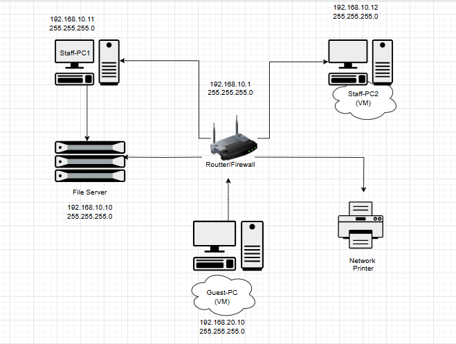**Question1.1**

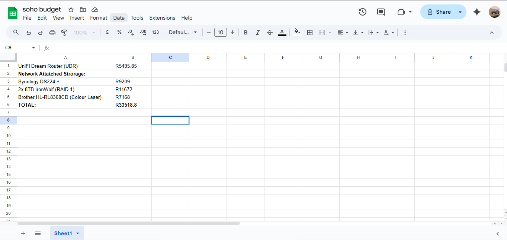**Question1.2**
[**<u>SOHO-Budget</u>**](https://docs.google.com/spreadsheets/d/1VNyceKz-guLX6_HI2n63NnFJNAz2gdh041wBPAmJOiY/edit?usp=sharing)

**UniFi**
**DreamRouter-R5495.85[<u>\_UniFiDreamRouter</u>](https://za.store.ui.com/za/en/products/udr)**

**\*Performance:**

> • GigabitRouting
>
> • WI-FI6withVLAN & Guestsupport
>
> • Canhandlemultipleuserssimultaneouslywithoutnetwork/system congestion

**\*Security:**

> o Built-infirewall& easynetworksegmentation
>
> o Built-inIntrusiondetectionand preventionsystemsfor unauthorized
> access

**\*Cost** **Effectiveness:**

> ▪ Atjustunder R5500,theUniFiDreamRouter
> providesenterprise-levelfeatures whilecostingalotless

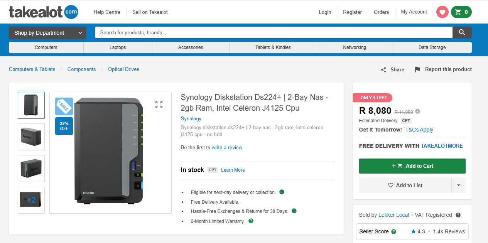

**SynologyDS224+-R9209[\_<u>SynologyDS224+</u>](https://www.takealot.com/synology-diskstation-ds224-2-bay-nas-2gb-ram-intel-celeron-j4125/PLID96614178?srsltid=AfmBOopMBsBPirbBye9t_4AxhyAW6AnxHxLhjaDUwyOq0bNdBIjmoikd)**

**\*Performance:**

> • DualCoreCPUforperformance
>
> • SupportsNFS(Linux)andSMB (Windows)
>
> • CanRunAutomated Bachup tasksand iseasilyexpandable

**\*Security:**

> o Builtinsnapshottechnologyfor quicksystem restoration
>
> o Fileencryptionand user accesscontrolensuringauthorized access only o
> Supportssecureremoteaccess

**\*Cost** **effectiveness:**

> ▪ Cheaper thanafullWindowsserver andeasier tomaintain

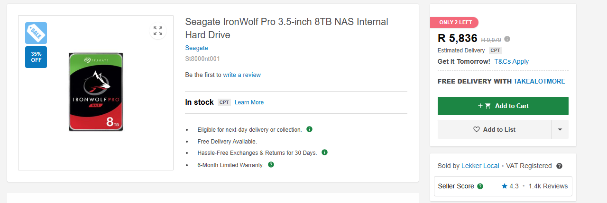

**X2Ironwolf** **8TB,RAID1-R5836** [**<u>X2Ironwolf
8TB,RAID1</u>**](https://www.takealot.com/seagate-ironwolf-pro-3-5-inch-8tb-nas-internal-hard-drive/PLID93370119?srsltid=AfmBOoqh4mWBa41y-PJGG-Hd_ZVo06sYheshT0pmyPfxYXe7QHvTN4jF)

**\*Performance:**

> • NASOptimized HDD,also24/7rated
>
> • RAID1/Mirroringensuresnodowntimeifonediskfails

**\*Security:**

> o Builtin systemsthatmonitorandmanagehealth+SMART monitoring

**\*Cost** **effectiveness:**

> ▪ AtjustR5836each,16TB Rawcapacitywith8TB usablemirrored
> storageisenough for multipleusersand atthesame timestillaffordable

**BrotherHL-L8360CDW**
**A4ColourLaserPriner-R7168[\_<u>BrotherHL-L8360CDW</u>](https://www.printerland.co.za/product/brother-hl-l8360cdw/141255)**

**\*Performance**

> • HighSpeed colorprinting • Duplexingsupport
>
> • Wireless+wired networking

**\*Security:**

> o SecurePrintrelease
>
> o Role-basedaccess(StaffvsGuest) o Integratesintosegmented networks

**\*Cost** **Effectiveness:**

> ▪ Atjustunder R8000,thisprinter giveslongterm valuefor qualitycolor
> printswith securityfeatureslikesecureprint release

**Question1.3**

**Snapshots**aretakenbeforeanyconfigurationchangeslike securitypolicies,
firewallrules and router configurations, thesearetaken torollback
incaseanyerror occurs.**Cloning** ensures**StaffPC**and **GuestPC**
**are**cloned from abaseVM,thereforesavingtimeand
ensuringthesetupsremainconsistent. ThewholeSOHOrunsonanisolated
environment,
soexperimentslikefirewallmisconfigsandmalwaretestingdon’taffectthehostsystem,
**Sandboxing**helpswiththis.**testingandflexibility**
ofVMsmeanthatyoucansimulate
VLANs,windowsfirewallrules,filesharingandbackupswithoutbuyingthephysical
hardware. **SecurityBenefits**arethatmalicioustrafficor
mistakesstayisolated insidethe VM environment,sothehostOSissafe.
Tohelp**Disasterrecovery** snapshotsand clones
areusedasbackupssothatifconfigurationsfailthenetworkcanberebuiltquickly.
**VirtualBoxbox**isfreeand accessiblewhilealsobeinggood enoughfor a SOHO
**simulation**,itsalternative**VMwareworkstation** isfreefor commercial
educationand personalusehowever from personalexperienceit
ishardtoaccess, butbetter for more advanced networking.

**Question1.4**

Good daywiththetaskIwasassigned toby Greenleaf
Architects,thefocusremained consistentonkeepingthingssecure,reliableand
atthesametimeaffordable.Thenetwork IdesignedputstheStaffand
Guestsintotwoseparatenetworks,thismeansthat visitors canaccessguestPCand
connecttotheinternetvia Wi-Fi,buttheywon’tbeabletoseeor touch your
sensitivecompanyfiles.Onthestaffsideofthe network,wehavesetupa backup
server thatautomatically savesand protectsyour
filesonaschedule,thisensures thatifaPCcrashesor filesgetdeleted
youdon’tloseimportantfiles.I’veincluded acolor
Lasorprintertosupportdailyoperationswhichisidealfor printingdesignsand
plans.The wholenetworkismanaged throughasecurerouter
withbuiltinfunctionslikea firewalland VLAN support
sothatyouhaveenterprisegradeprotectionatnearlyhalfthecost.Bestof
allthissolution stayswellwithinthebudget.Itscosteffectiveand
atthesametime designed togrowwithyou intheeventofyouexpandingthesystem
canscalewithoutyou startingallover. Inconclusionthissetup
providespeaceofmind,keepsyourdatasafe and
supportsthewayyouworkinasimpleway

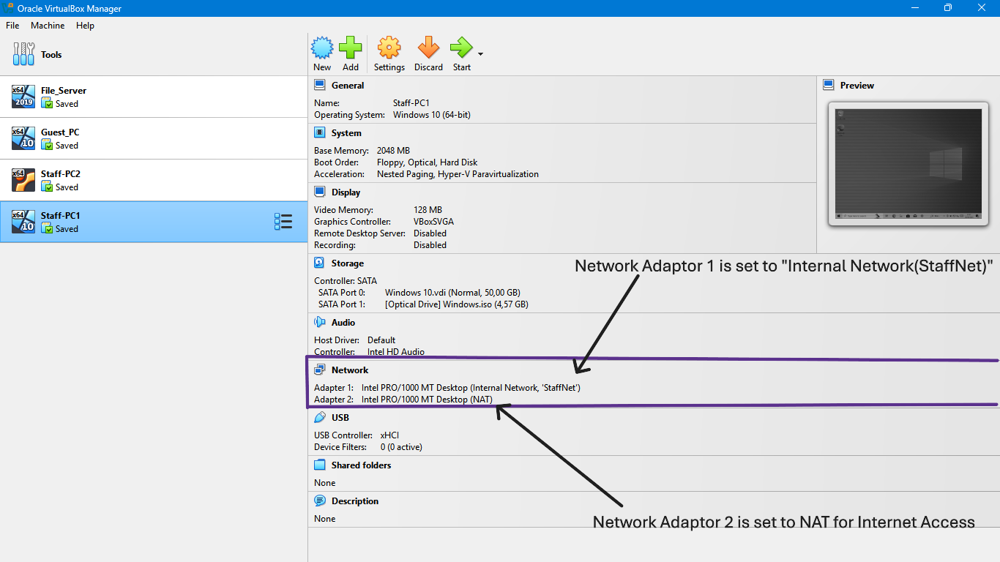

**Question2.1**

> **Figure1.1:**VirtualMachinesSimulatingtheSOHO

**Figure1.2:**StaffPC1isonanInternalNetworkcalled
“StaffNet”usingnetworkAdaptor1 and Adaptor 2issettoNAT
tosimulateInternetAccessseparatefrom theinternalnetwork

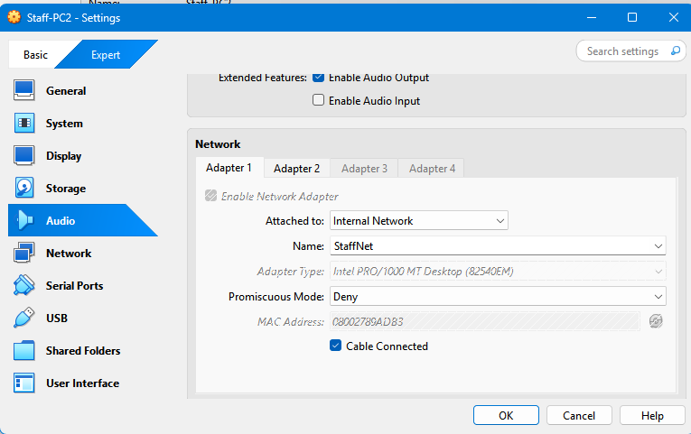

**Figure1.3&1.4:**ShowtheindiviualNetworksettingssimulatingaVLAN with
Internet Access

**StaffPC2**

**Figure1.5:**StaffPC2alsohasAdaptor1setto“StaffNet”,simulatingaVLAN and
Adaptor 2 issettoNAT for accesstotheinternet

**Figure1.6&1.7:**StaffPC2IndividualSettingsfor
bothnetworkadaptorssimulating networksegmentation

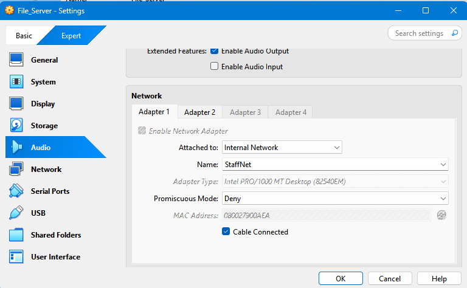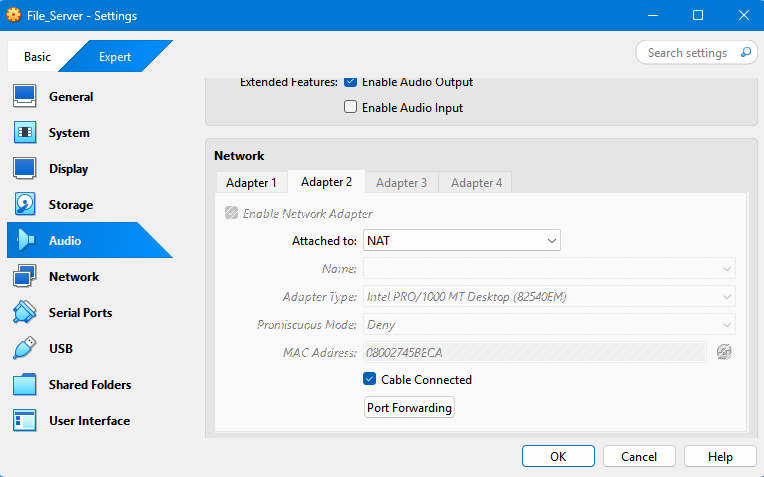

**FileServer**

**Figure1.8:**FileServer Adaptor 1issetto“StaffNet”aswellfor easyybackup
andfile access.Aswellasnetworkadministrationtools

**Figure1.9&1.10:**IndividualSettingsfor FileServer

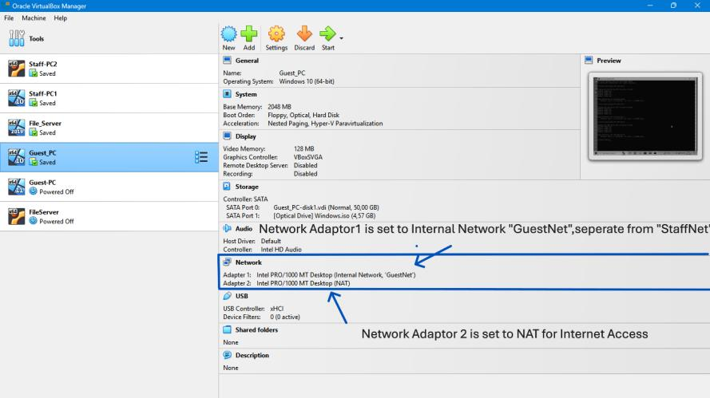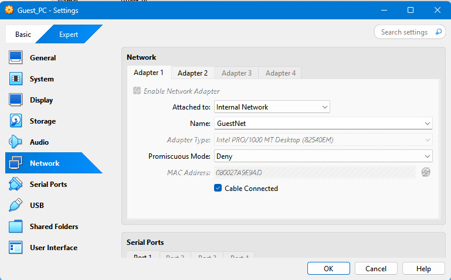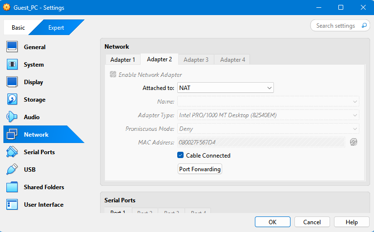

**GuestPC**

**Figure1.11:**NetworkAdaptor
1issetonadifferentinternalnetworkthanbothstaffpc’s and
FileServertosegmenttheStaffNetnetworkand GuestNetNetwork

**Figure1.12&1.13:**IndividualSettingsfor eachGuestPC,Networkadaptor
2SettoNAT for internetaccess

**Question2.2**

**WindowsServerFirewallSettings**

**Figure2:**WindowsServer
FirewallInboundRulesIndicatingaruletoblockallinbound trafiiccomingfrom
GuestPCtoFileServer

**Figure2.1:**GuestPCcannotaccessFileServer

**Figure2.2:**StaffPC2canaccessFileServer throughsmb\\192.168.10.10

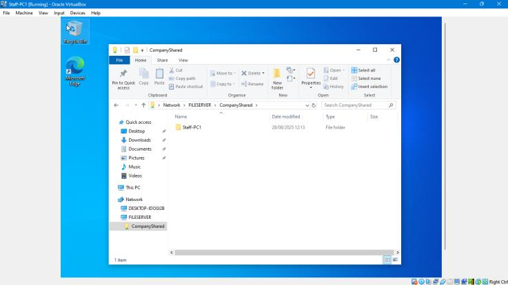

**Figure2.3:**StaffPC1canaccesFileServer throughfileexplore

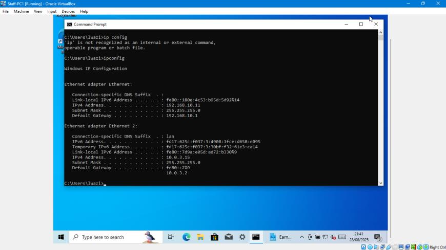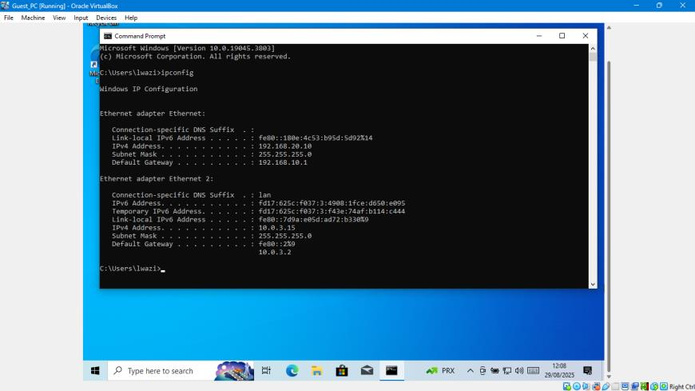

**Question2.3**

**Figure3:**StaffPC1waschanged toastaticaddressof “192.168.10.11”

**Figure3.1:**GuestPCIPwaschanged tostatic“192.168.20.10”

**Figure3.2:**StaffPC2addressschanged tostatic“192.168.10.12”

**Figure3.4:**FileServer
IPaddresschanged toastatic“192.168.10.10”

**Figure3.5:** StaffPC1pingtoFileServer IPaddressis
receivedat0%lossofpackets indicatingcommunication

**Figure3.6:**Nopacketsreceivedfrom FileServer
whenpingbyGuestPCissent,pingresults
in100%lossofpacketsindicatingnocommunicationbetweenboth

**Figure3.7:**StaffPC2pingtoFileServer IPaddressisreceived
at0%lossofpackets indicatingcommunicationbetweenStaffPC2andFileServer

**Question2.4**

**Figure4:**NetworkFileisshared from theFileServer \\FILESERVER\\

**Figure4.1:**StaffPC1canaccessNetworkPrinter and shared
networkfoldersfrom FileSercer(192.168.10.10)

**Figure4.2:**StaffPC2canaccessshared NetworkFoldersaswellasShared
printer onthe network

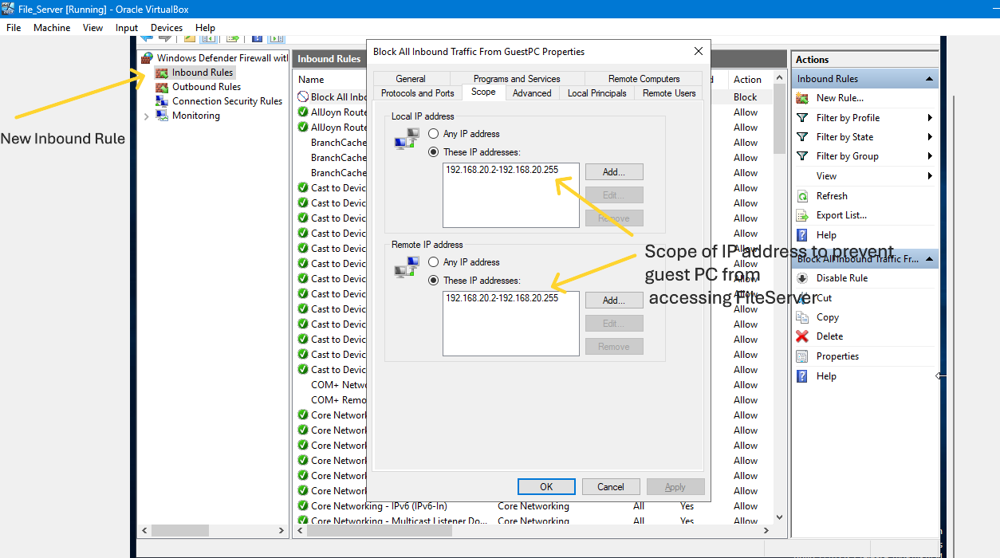

**BackUp** **Schedule**

**Figure5:**WindowsServer Firewallhasbeenconfigured
toblockinboundtrafficfromthe
scope192.168.20.3-192.168.20.255topreventGuestPCfromunauthorizedaccess

**Figure5.2:**Ascheduled backup hasbeenconfigured tobeginat23:00everyday

**Figure5.3:**Printer propertiesIndicateprinter isshared from
FileServer(192.168.10.10)

*Inorder* *tomakesurethat* *allcompanydataissafeand*
*businesscontinues,* *ascheduled* *backupand*
*retentionstrategyhasbeensetup* *onthisfileserver.Backupsarescheduled*
*at* *23:00everydaywheneveryoneisout*
*ofofficetoavoidslowingdownproductionduringthe* *day.Eachbackup*
*isretained* *for* *30daysand* *thendeleted* *after*
*topreservestorage.* *Backupsarestored* *onNAS,* *whichisconfigured*
*usingRAID1so* *thatdataremainsavailable* *evenif*
*onedrivefails.Thispolicyensuresfilescanberestored* *quickly* *from*
*themost* *recent*
*backupwhilesimultaneouslyholdingthewholemonthsofrecoveryhistory,*
*balancing,* *performance,* *reliabilityandcost* *effectivenessfor*
*asmalloffice*

**Figure5.4:**WindowsServer firewallsettingsblockingFTPand allinbound
trafficfrom GuestPC

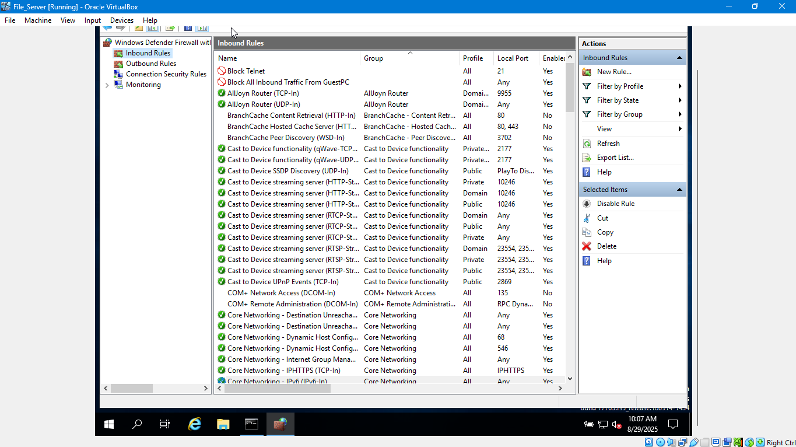

**Figure5.4:**Port21(FTP)blocked topreventpeoplefrom
transferringfilesinsecurely

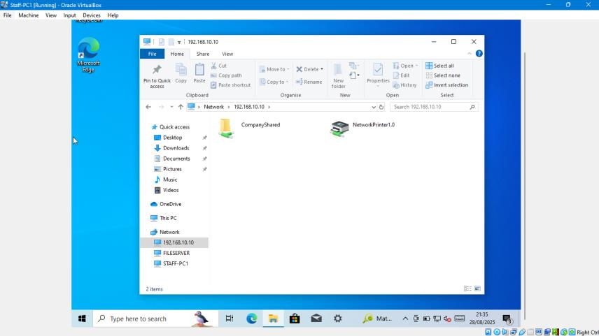

**Question2.6**

**Figure5.7&5.8:** STaffPC1& StaffPC2canaccessFILESERVER network

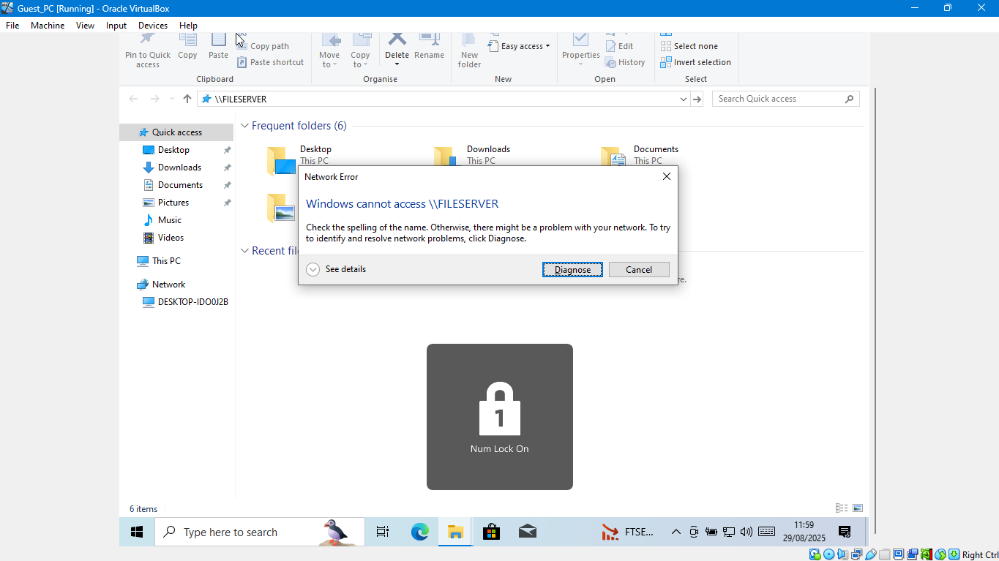

**Figure5.9:**GuestPCcannotaccessFileServer

**Question3.1**

**Question3.2**

**Whensettingup** **thiskind** **of**
**smallofficenetwork,afewrisksstand** **out:**

**FirewallMisconfiguration**

Ifthefirewallrulesaren’tsetupcorrectly,theGuestPCcould
accidentallyaccess
sensitivestafffiles.That’sadirectdatasecurityrisk.Thefixissimple:alwaystesttherules
after applyingthem and keep accessona“need-to-use”basisonly.

**Backup** **Failure:**

**Ifthebackup** **systemfails** —whether from amisconfigured
schedule,hardwareissues, or evensomeoneforgettingtocheckit
—thebusinesscould losecriticaldesignfileswith nowaytorecover
them.Toreducethisrisk,we’d useRAID forredundancy,rundaily automated
backups,andkeep acopyoffsiteorinthecloud.

**VMResourceLimits-**Becauseeverythingisrunningasvirtualmachines,there’salwaysa
chancethehostcomputer doesn’thaveenoughRAM or CPUtohandlethem smoothly.
Thatcould slowthingsdownor evencrashservices.Thewayaround
thisistoallocate resourcescarefullyand,iftheworkload
grows,movetoamorepowerfulhostorcloud-based solution.

**Question3.3**

**Virtualmachinelimitations-**VMsdepend onthehostscomputer hardwareand
resources.IfanycomponentlikeCPU/RAM isoverloaded thisdirectlyaffects
performance.Notsuitablefor productionscaleloads.

**Firewalllimitations-**Misconfigscanblockvalidtrafficor
leavesomevulnerabilitiesopen. Itrequiresconstantreviewingand testing

**DataLoss/Corruption** **Risk-**Retentiongapsand
hardwarefailurecancauseloss regardlessofanybackup inplace.
