# SOHO Network Design & Simulation

## Project Overview
Design and implementation of a secure Small Office/Home Office network for Greenleaf Architects using virtualisation technology, featuring network segmentation, security controls, and automated backup systems within a R70,000 budget.

## Skills Demonstrated
- Virtual Network Design & Segmentation
- VLAN Implementation using VirtualBox
- Windows Firewall Configuration
- Network Security & Access Control
- Backup Strategy Implementation
- Cost Analysis & Budget Planning
- Risk Assessment

## Technical Implementation
- **Virtualization Platform**: VirtualBox
- **Network Segmentation**: StaffNet & GuestNet VLANs
- **Security**: Windows Firewall rules, port blocking
- **Backup**: Scheduled automated backups with retention policy
- **Budget**: R70,000 hardware budget with cost justification

## Features
- Isolated guest network
- Centralized file server
- Automated backup system
- Network printing capabilities
- Secure firewall configurations

---

# Project Documentation

##  1.1 - Network Topology Design

The network topology features segmented VLANs with StaffNet (192.168.10.0/24) and GuestNet (192.168.20.0/24) networks, providing logical separation between staff and guest devices while maintaining internet access for both.

## 1.2 - Hardware Budget
[**SOHO-Budget Spreadsheet**](https://docs.google.com/spreadsheets/d/1VNyceKz-guLX6_HI2n63NnFJNAz2gdh041wBPAmJOiY/edit?usp=sharing)

### UniFi Dream Router - R5,495.85
[Product Link](https://za.store.ui.com/za/en/products/udr)

**Performance:**
- Gigabit Routing
- Wi-Fi 6 with VLAN & Guest support
- Can handle multiple users simultaneously without network/system congestion

**Security:**
- Built-in firewall & easy network segmentation
- Built-in Intrusion detection and prevention systems for unauthorized access

**Cost Effectiveness:**
- At just under R5500, the UniFi Dream Router provides enterprise-level features while costing a lot less

### Synology DS224+ - R9,209.00
[Product Link](https://www.takealot.com/synology-diskstation-ds224-2-bay-nas-2gb-ram-intel-celeron-j4125/PLID96614178)

**Performance:**
- Dual Core CPU for performance
- Supports NFS (Linux) and SMB (Windows)
- Can Run Automated Backup tasks and is easily expandable

**Security:**
- Built in snapshot technology for quick system restoration
- File encryption and user access control ensuring authorized access only
- Supports secure remote access

**Cost effectiveness:**
- Cheaper than a full Windows server and easier to maintain

### X2 Ironwolf 8TB, RAID1 - R11,672.00
[Product Link](https://www.takealot.com/seagate-ironwolf-pro-3-5-inch-8tb-nas-internal-hard-drive/PLID93370119)

**Performance:**
- NAS Optimized HDD, also 24/7 rated
- RAID1/Mirroring ensures no downtime if one disk fails

**Security:**
- Built in systems that monitor and manage health + SMART monitoring

**Cost effectiveness:**
- At just R5836 each, 16TB Raw capacity with 8TB usable mirrored storage is enough for multiple users and at the same time still affordable

### Brother HL-L8360CDW A4 Colour Laser Printer - R7,168.00
[Product Link](https://www.printerland.co.za/product/brother-hl-l8360cdw/141255)

**Performance:**
- High Speed color printing
- Duplexing support
- Wireless + wired networking

**Security:**
- Secure Print release
- Role-based access (Staff vs Guest)
- Integrates into segmented networks

**Cost Effectiveness:**
- At just under R8000, this printer gives long term value for quality color prints with security features like secure print release

**Total Budget: R33,544.85**

## 1.3 - Virtualization Benefits

**Snapshots** are taken before any configuration changes like security policies, firewall rules and router configurations, these are taken to roll back in case any error occurs. **Cloning** ensures **StaffPC** and **GuestPC** are cloned from a base VM, therefore saving time and ensuring the setups remain consistent. The whole SOHO runs on an isolated environment, so experiments like firewall misconfigs and malware testing don't affect the host system, **Sandboxing** helps with this. **Testing and flexibility** of VMs mean that you can simulate VLANs, windows firewall rules, file sharing and backups without buying the physical hardware. **Security Benefits** are that malicious traffic or mistakes stay isolated inside the VM environment, so the host OS is safe. To help **Disaster recovery** snapshots and clones are used as backups so that if configurations fail the network can be rebuilt quickly. **VirtualBox** is free and accessible while also being good enough for a SOHO **simulation**, its alternative **VMware workstation** is free for commercial education and personal use however from personal experience it is hard to access, but better for more advanced networking.

## 1.4 - Client Pitch

Good day with the task I was assigned to by Greenleaf Architects, the focus remained consistent on keeping things secure, reliable and at the same time affordable. The network I designed puts the Staff and Guests into two separate networks, this means that visitors can access guest PC and connect to the internet via Wi-Fi, but they won't be able to see or touch your sensitive company files. On the staff side of the network, we have setup a backup server that automatically saves and protects your files on a schedule, this ensures that if a PC crashes or files get deleted you don't lose important files. I've included a color Laser printer to support daily operations which is ideal for printing designs and plans. The whole network is managed through a secure router with built in functions like a firewall and VLAN support so that you have enterprise grade protection at nearly half the cost. Best of all this solution stays well within the budget. Its cost effective and at the same time designed to grow with you in the event of you expanding the system can scale without you starting all over. In conclusion this setup provides peace of mind, keeps your data safe and supports the way you work in a simple way.

---

## 2.1 - Virtual Machine Configuration

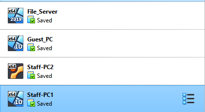 

**Figure 1.1:** Virtual Machines Simulating the SOHO

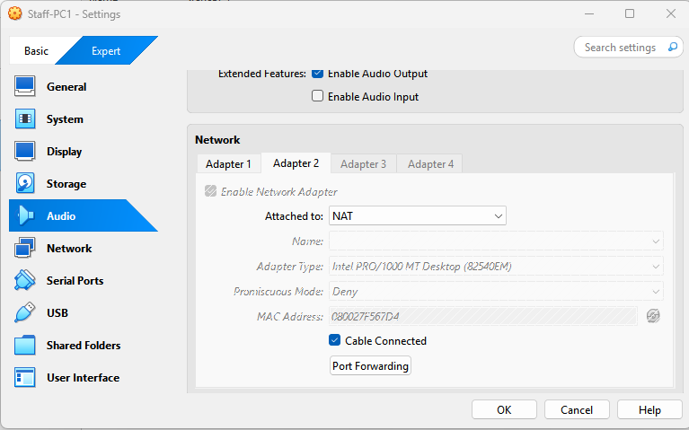 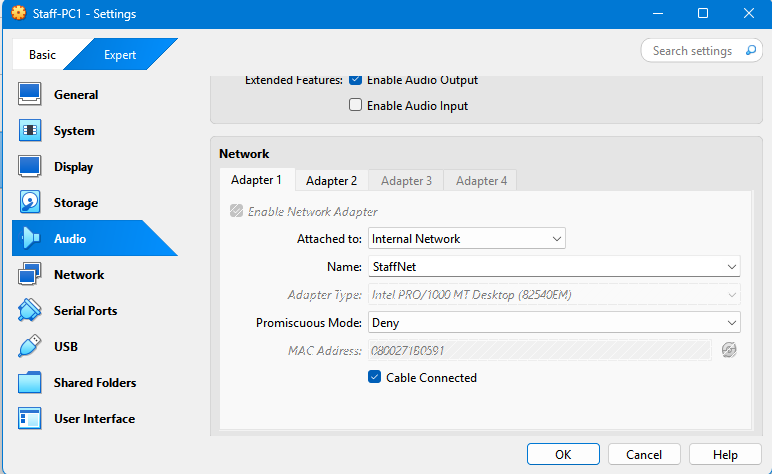

**Figure 1.2:** StaffPC1 is on an Internal Network called "StaffNet" using network Adaptor 1 and Adaptor 2 is set to NAT to simulate Internet Access separate from the internal network

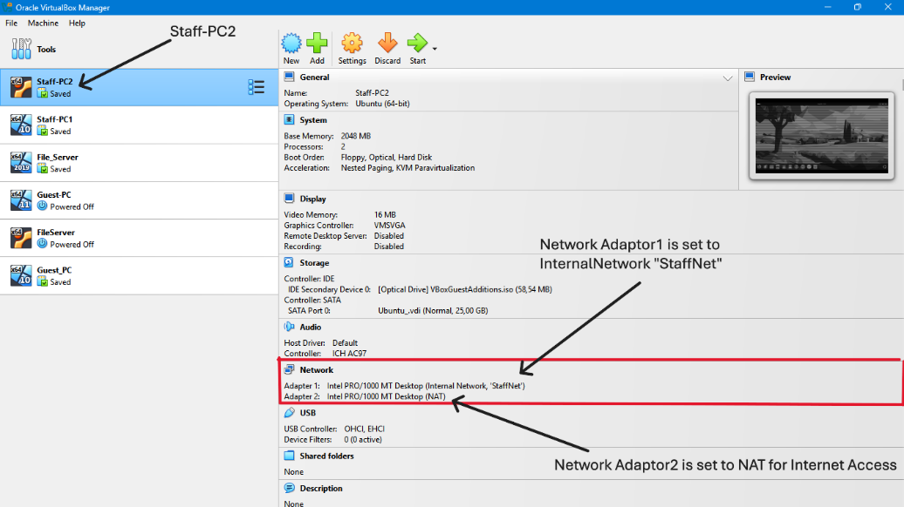  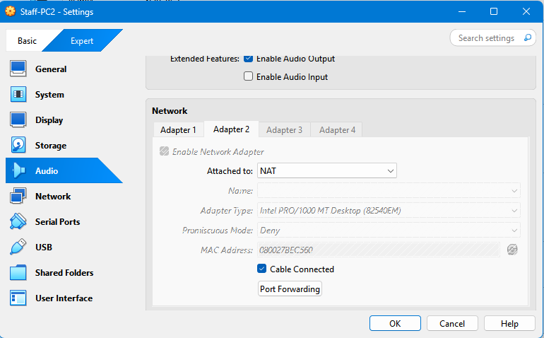

**Figure 1.3 & 1.4:** Show the individual Network settings simulating a VLAN with Internet Access

**StaffPC2**

**Figure 1.5:** StaffPC2 also has Adaptor 1 set to "StaffNet", simulating a VLAN and Adaptor 2 is set to NAT for access to the internet

**Figure 1.6 & 1.7:** StaffPC2 Individual Settings for both network adaptors simulating network segmentation

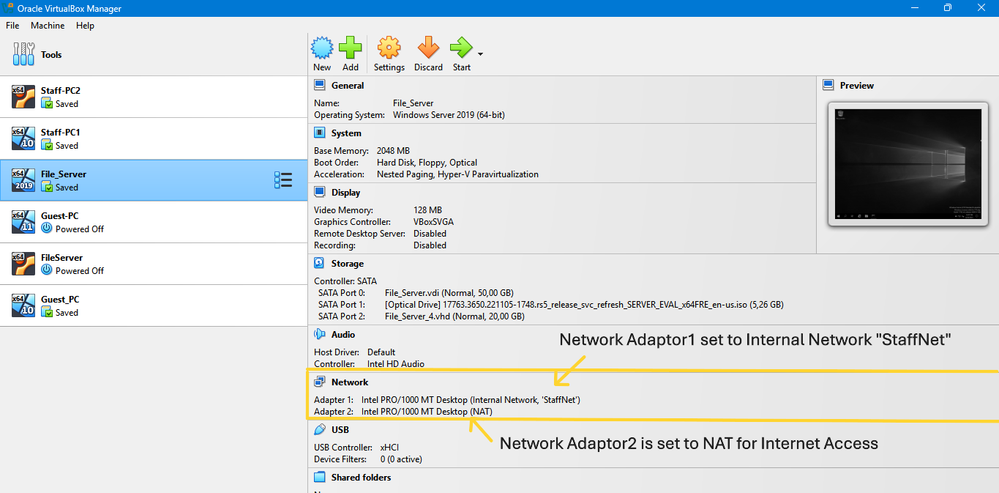  

**FileServer**

**Figure 1.8:** FileServer Adaptor 1 is set to "StaffNet" as well for easy backup and file access. As well as network administration tools

**Figure 1.9 & 1.10:** Individual Settings for FileServer

  

**GuestPC**

**Figure 1.11:** Network Adaptor 1 is set on a different internal network than both staff pc's and FileServer to segment the StaffNet network and GuestNet Network

**Figure 1.12 & 1.13:** Individual Settings for each GuestPC, Network adaptor 2 Set to NAT for internet access

---

##  2.2 - Network Isolation & Firewall Configuration

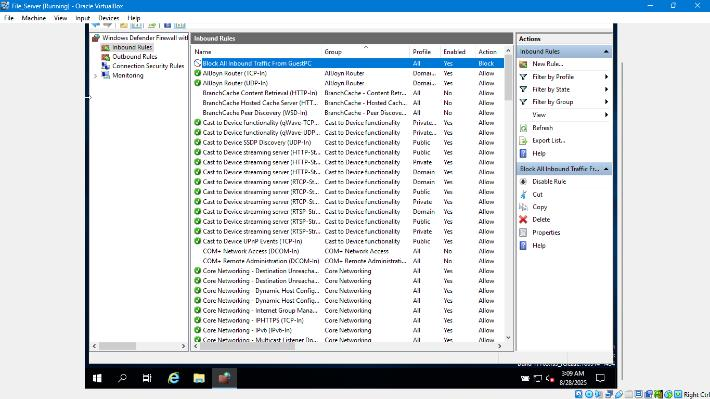 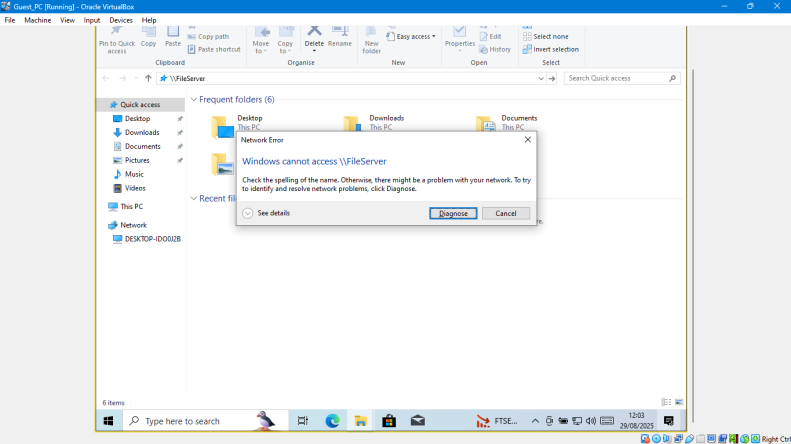 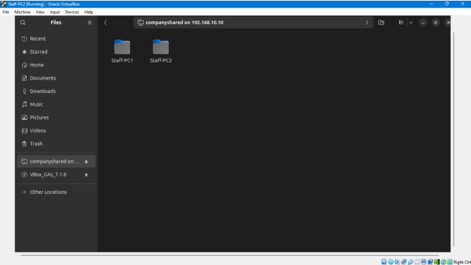

**Windows Server Firewall Settings**

**Figure 2:** Windows Server Firewall Inbound Rules Indicating a rule to block all inbound traffic coming from GuestPC to FileServer

**Figure 2.1:** GuestPC cannot access FileServer

**Figure 2.2:** StaffPC2 can access FileServer through smb\\192.168.10.10

**Figure 2.3:** StaffPC1 can access FileServer through file explorer

---

##  2.3 - Static IP Configuration & Testing

 

**Figure 3:** StaffPC1 was changed to a static address of "192.168.10.11"

**Figure 3.1:** GuestPC IP was changed to static "192.168.20.10"

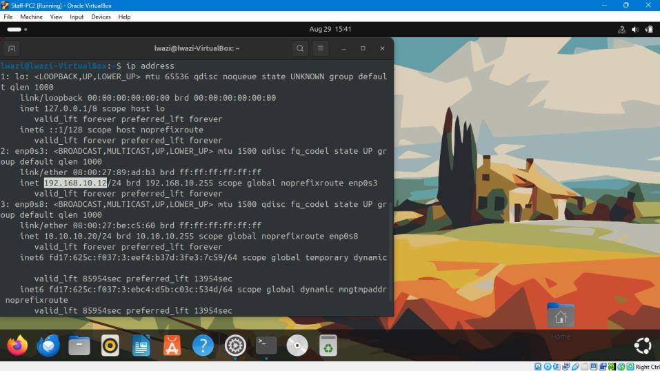 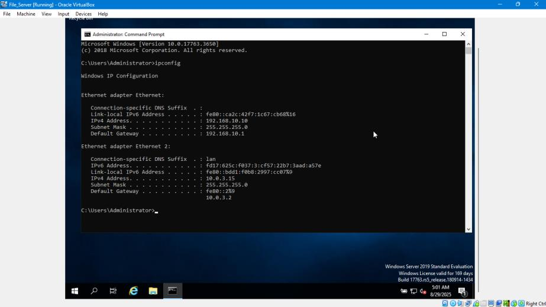

**Figure 3.2:** StaffPC2 addresses changed to static "192.168.10.12"

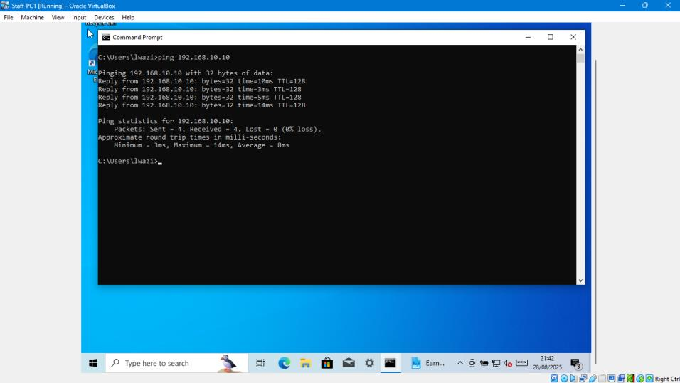

**Figure 3.4:** FileServer IP address changed to a static "192.168.10.10"

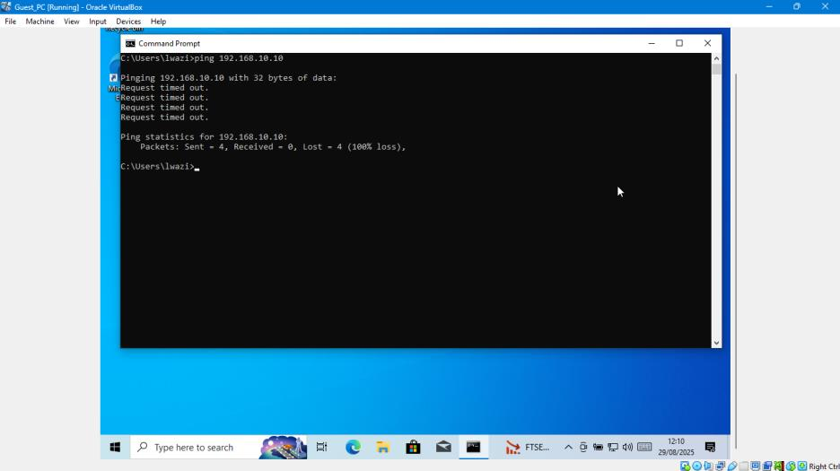 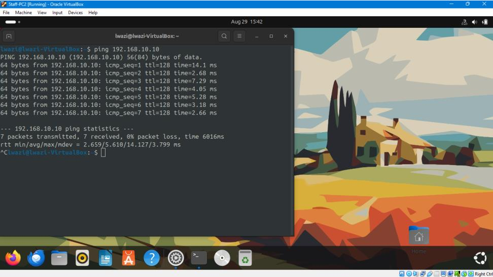

**Figure 3.5:** StaffPC1 ping to FileServer IP address is received at 0% loss of packets indicating communication

**Figure 3.6:** No packets received from FileServer when ping by GuestPC is sent, ping results in 100% loss of packets indicating no communication between both

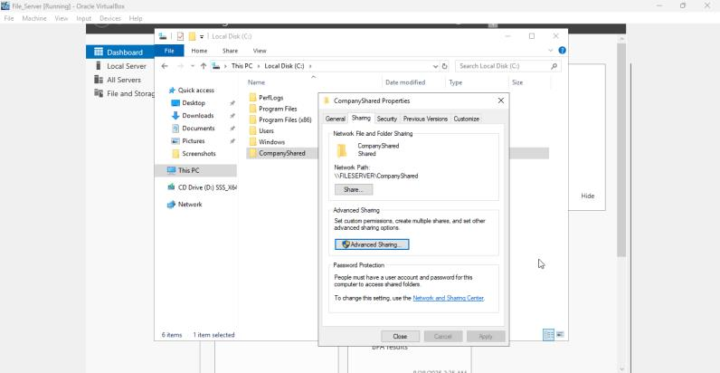

**Figure 3.7:** StaffPC2 ping to FileServer IP address is received at 0% loss of packets indicating communication between StaffPC2 and FileServer

---

## 2.4 - File Sharing & Network Access

 

**Figure 4:** Network File is shared from the FileServer \\FILESERVER\\

**Figure 4.1:** StaffPC1 can access NetworkPrinter and shared network folders from FileServer(192.168.10.10)

**Figure 4.2:** StaffPC2 can access shared Network Folders as well as Shared printer on the network

---

## Backup Schedule & Security Configuration

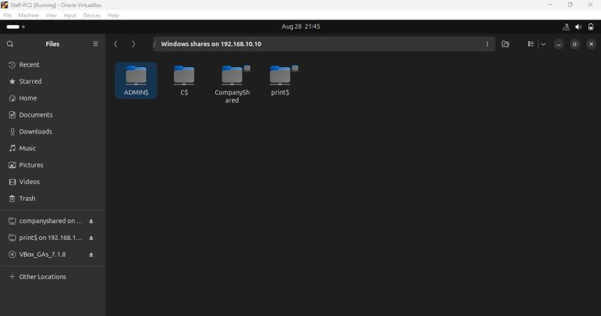 

**BackUp Schedule**

**Figure 5:** Windows Server Firewall has been configured to block inbound traffic from the scope 192.168.20.3-192.168.20.255 to prevent GuestPC from unauthorized access

**Figure 5.2:** A scheduled backup has been configured to begin at 23:00 every day

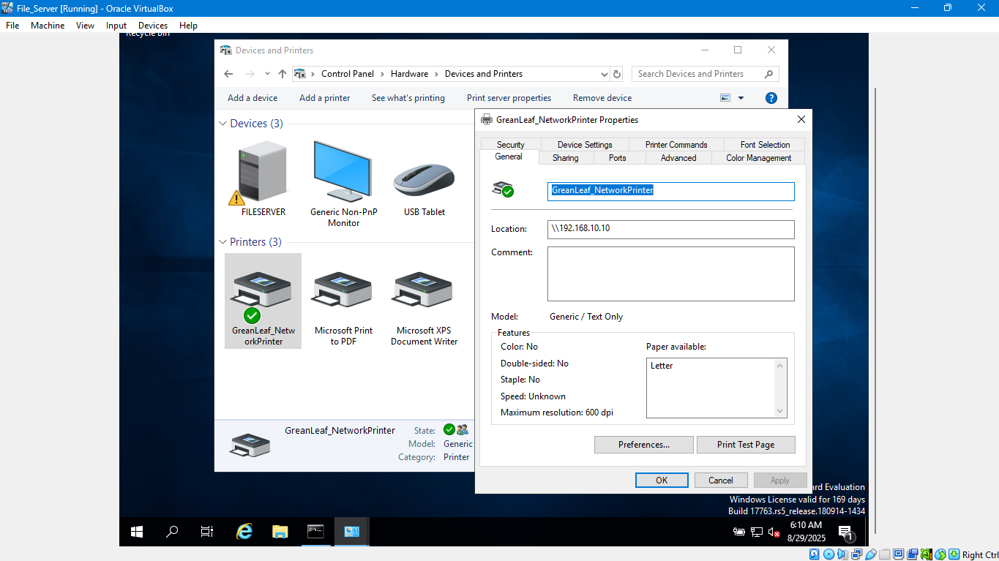

**Figure 5.3:** Printer properties Indicate printer is shared from FileServer(192.168.10.10)

*In order to make sure that all company data is safe and business continues, a scheduled backup and retention strategy has been setup on this fileserver. Backups are scheduled at 23:00 every day when everyone is out of office to avoid slowing down production during the day. Each backup is retained for 30 days and then deleted after to preserve storage. Backups are stored on NAS, which is configured using RAID1 so that data remains available even if one drive fails. This policy ensures files can be restored quickly from the most recent backup while simultaneously holding the whole months of recovery history, balancing, performance, reliability and cost effectiveness for a small office*

 

**Figure 5.4:** Windows Server firewall settings blocking FTP and all inbound traffic from GuestPC

**Figure 5.4:** Port 21 (FTP) blocked to prevent people from transferring files insecurely

---

## 2.6 - Network Access Verification

 

**Figure 5.7 & 5.8:** StaffPC1 & StaffPC2 can access FILESERVER network

**Figure 5.9:** GuestPC cannot access FileServer

---

## 3.1 - Final Network Diagram

** 3.1:** Updated network topology showing complete SOHO implementation with all devices and network segmentation.

---

##  3.2 - Risk Assessment

**When setting up this kind of small office network, a few risks stand out:**

### Firewall Misconfiguration
If the firewall rules aren't set up correctly, the Guest PC could accidentally access sensitive staff files. That's a direct data security risk. The fix is simple: always test the rules after applying them and keep access on a "need-to-use" basis only.

### Backup Failure:
**If the backup system fails** — whether from a misconfigured schedule, hardware issues, or even someone forgetting to check it — the business could lose critical design files with no way to recover them. To reduce this risk, we'd use RAID for redundancy, run daily automated backups, and keep a copy offsite or in the cloud.

### VM Resource Limits
Because everything is running as virtual machines, there's always a chance the host computer doesn't have enough RAM or CPU to handle them smoothly. That could slow things down or even crash services. The way around this is to allocate resources carefully and, if the workload grows, move to a more powerful host or cloud-based solution.

---

## 3.3 - System Limitations

### Virtual machine limitations
VMs depend on the hosts computer hardware and resources. If any component like CPU/RAM is overloaded this directly affects performance. Not suitable for production scale loads.

### Firewall limitations
Misconfigs can block valid traffic or leave some vulnerabilities open. It requires constant reviewing and testing.

### Data Loss/Corruption Risk
Retention gaps and hardware failure can cause loss regardless of any backup in place.

---

## Project Summary

This SOHO network design successfully demonstrates a secure, cost-effective solution for Greenleaf Architects featuring:

- **Network Segmentation**: Complete isolation between StaffNet and GuestNet VLANs
- **Security Implementation**: Comprehensive Windows Firewall rules and port blocking
- **Backup Strategy**: Automated daily backups with 30-day retention policy
- **Budget Compliance**: Total hardware cost of R33,544.85 within R70,000 budget
- **Virtualization Benefits**: Efficient testing and deployment using VirtualBox
- **Risk Management**: Identified and mitigated key technical risks

The solution provides enterprise-level security features at small business pricing while maintaining scalability for future growth.
